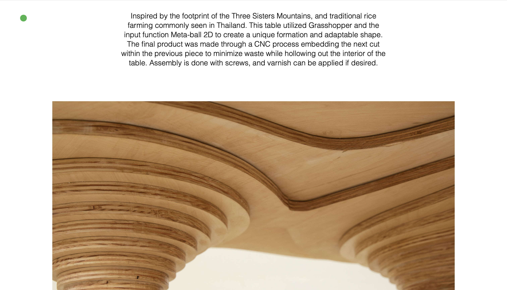
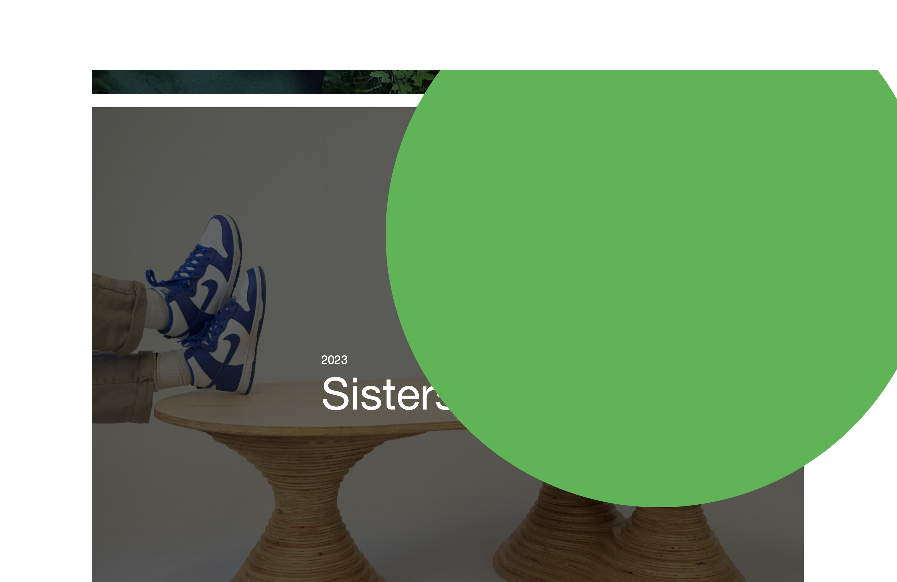

# Portfolio_V

Welcome to Portfolio_V, a portfolio demo built using HTML, CSS, and JavaScript.

This was a creative project made for a peer at the University of Oregon. He studied Product design, displaying what he's made at UO is the main focus of the website. 

The website features forward thinking web design, fullscreen high quality images, an easy to navigate interface and intresting animaions created in JS.

To see a demo visit: https://bigo96.github.io/Portfolio_V/

# Credit

This Portfolio website was created by Oscar Epp

All projects featured on the website were created by Ethan Varney